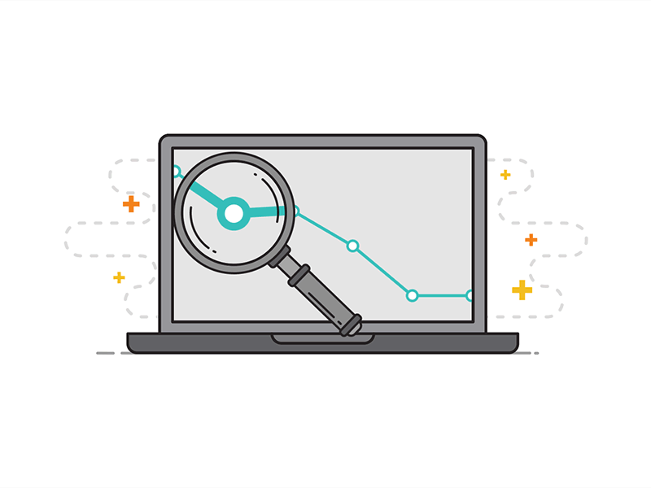

[Home](README.md){: .btn .btn-primary } 
[Projects](projectPage.md){: .btn .btn-success } 
[About](about.md){: .btn .btn-info }

---

**Welcome!** I'm Peter, a UC Berkeley student studying data science and economics.

I have a passion for understanding and making use of data, and tackling complex problems using statistical thinking. Visit my projects page for a tour of my work, and visit the about tab for more info on me and to get in touch.

  

