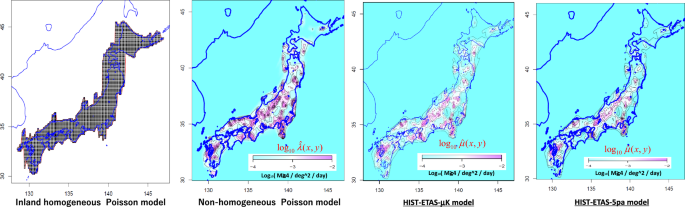
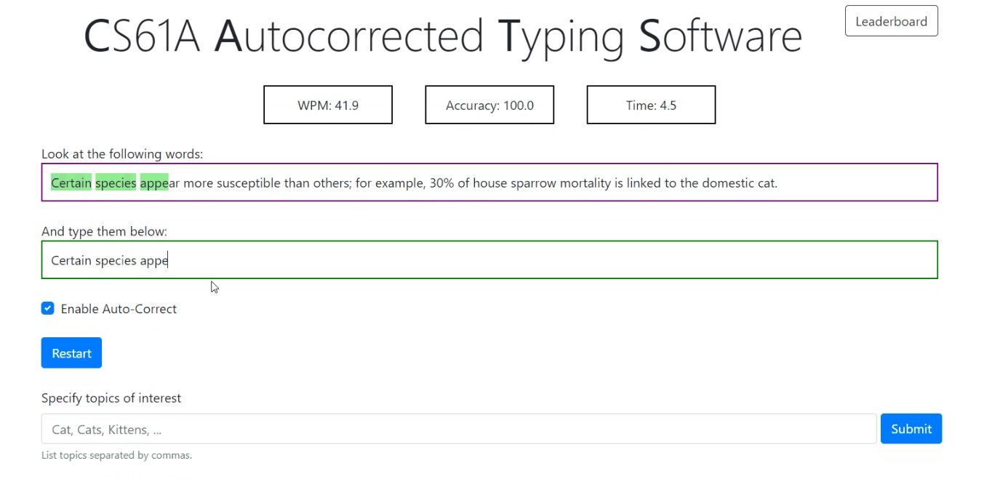

Click on a project to view more details, including code snippets, images, and summaries.

---

## Civic Sales Financial Model
  
Used past sales data of Honda Civics, seasonality, and economic factors as time series training data for a Civic sales prediction model.
[**View Project Details »**](./projects/civic-sales)

---

## Loans / Coronary Risk Modeling
 
Predicted probability of coronary heart disease in patients, and modelled cost/benefit of medication, and outcomes.
[**View Project Details »**](./projects/loans-coronary-risk)

---

## Yelp Reviews
  
Used several decision tree and random forest models to predict yelp reviews, and used data to suggest what venue features lead to highest customer satisfaction.
[**View Project Details »**](./projects/yelp-reviews)

---

## OCR Model
  
Implemented sci-kit learn decision tree models trained on hand-written English letters
[**View Project Details »**](./projects/ocr-predictions)

---

## Amazon Review Sentiment Prediction
 
Used a variety of ML techniques to detect sentiment (positive/negative) of amazon reviews in raw text format.
[**View Project Details »**](./projects/amazon-review-sentiment)

---

## Pacman Search
 
Pathfinding pacman clone, where pacman finds optimal path to food. Used various search trees for entity pathfinding algorithms.
[**View Project Details »**](./projects/projName)

---

## Pacman AI game
 
A full iteration of pacman where minimax/expectimax search with evaluation functions dictate the agents' next actions in the 2d world.
[**View Project Details »**](./projects/projName)

---

## Pacman Blind AI
 
Blind Pacman's faulty sensors make use of bayes nets CPTs and probabilistic inference to locate likeliest ghost positions, and path to them.
[**View Project Details »**](./projects/projName)

---

## Reinforcement Learning
 
Applied value iteration and Q-learning RL algorithms to a robot in a non-deterministic 2D world to find the optimal path through it.
[**View Project Details »**](./projects/projName)

---

## Neural Network Applications
 
Implemented NNs to read MNIST digits, detect language of text, approximate various functions, and generate Shakespeare using a GPT architecture .
[**View Project Details »**](./projects/projName)

---

## Earthquake Modelling
 
Modelled probabilities of future Earthquakes in CA given past data using poisson processes.
[**View Project Details »**](./projects/projName)

---

## Housing Price Prediction Tool
 
Trained a regression model on Chicago Home Prices and built a feature engineering pipeline, and assessed model performance across high/low value homes.
[**View Project Details »**](./projects/projName)

---

## Spam Email Filter
 
Used logistic regression to assess probability of spam for emails, used various features and assessed false positive/negative rates.
[**View Project Details »**](./projects/projName)

---

## IMDB Ratings Analytics
 
Performed data exploration and analysis on imdb dataset in SQL. 
[**View Project Details »**](./projects/projName)

---

## File Similarity Scoring Tool
 
Used a pretrained hugging face model to compute cosine similarity between two files' content.
[**View Project Details »**](./projects/projName)

---

## Industrial Automation Analytics
 
Explored and assessed the impact and rates of automation across all major industries in US recent history, and explored economic indicators such as market futures volatility and interest rates.
[**View Project Details »**](./projects/projName)

---

## Typing Race Game with Autocorrection
 
Implemented a TypeRacer game playable in python which featured an Autocorrect tool, WPM tracking and typing accuracy.
[**View Project Details »**](./projects/projName)

---

## 2048 Game
 
A playable clone of the classic browser game "2048", featuring a pleasant graphical interface.
[**View Project Details »**](./projects/projName)

---

## 2D World Game
 
Designed a 2D playable game in Java, featuring save & load, random seeds for game novelty, and a user interface.
[**View Project Details »**](./projects/projName)

---

## Pharma Stock Correlation Research
 
Designed a custom python tool for checking how the movement of one stock over desired time period was absorbed by the market, wrote findings in a paper.
[**View Project Details »**](./projects/projName)

## Google Words Trends
 
Built an interface in Java to explore timeseries trends data for the history of any word in the English corpus from a google dataset.
[**View Project Details »**](./projects/projName)

---

## Scheme Code Interpreter
 
Written in python, the Scheme Interpreter parses and executes user entered code in the Scheme programming language.
[**View Project Details »**](./projects/projName)

---

