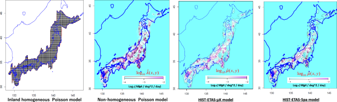
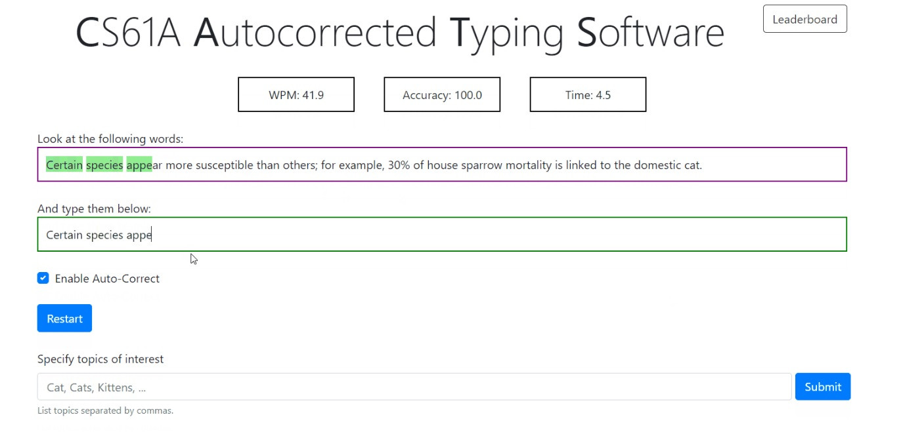
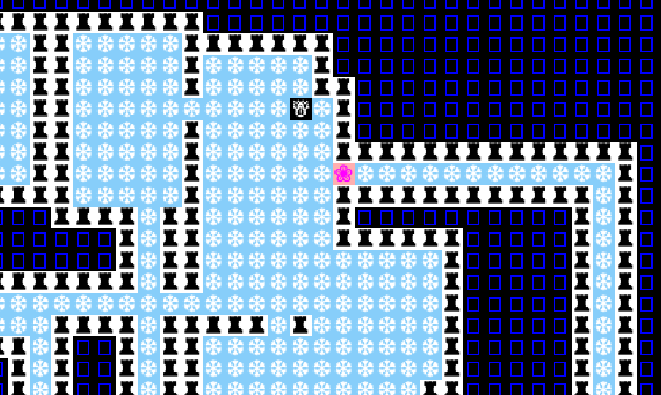
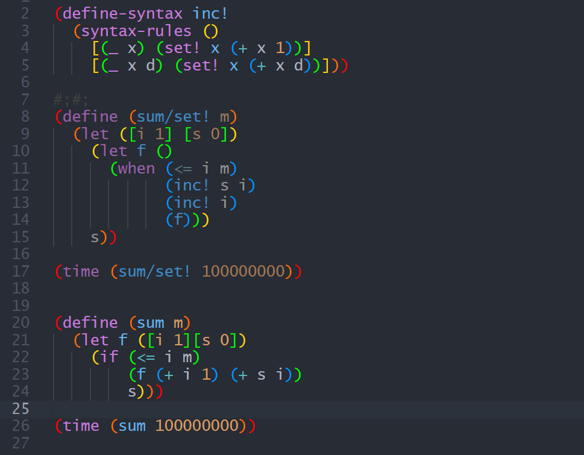

[Home](README.md){: .btn .btn-primary } 
[Projects](projectPage.md){: .btn .btn-success } 
[About](about.md){: .btn .btn-info }

---

Here, you'll find my recent programming projects, involving work in data analysis, math, ML, and more.
Click on a project's image to view a pdf preview, or click the blue hyperlink to view the project on github.

---

## Civic Sales Financial Model

 

Used past sales data of Honda Civics, seasonality, and economic factors as time series training data for a Civic sales prediction model.

[**Check it out on GitHub »**](https://github.com/peterjmanning/142a/blob/main/civic-sales.ipynb)

---

## Loans / Coronary Risk Modeling

 

Predicted probability of coronary heart disease in patients, and modelled cost/benefit of medication, and outcomes.

[**Check it out on GitHub »**](https://github.com/peterjmanning/142a/blob/main/coronary-risk-modeling.ipynb)

---

## Yelp Reviews

 

Used several decision tree and random forest models to predict yelp reviews, and used data to suggest what venue features lead to highest customer satisfaction.

[**Check it out on GitHub »**](https://github.com/peterjmanning/142a/blob/main/yelp-reviews.ipynb)

---

## OCR Model

 

Implemented sci-kit learn decision tree models trained on hand-written English letters.

[**Check it out on GitHub »**](https://github.com/peterjmanning/142a/blob/main/OCR-predictions.ipynb)

---

## Amazon Review Sentiment Prediction

 

Used a variety of ML techniques including logistic regression, gated recurrent unit network, and conv. neural network, to predict sentiment of raw text amazon product reviews.

[**Check it out on GitHub »**](https://github.com/peterjmanning/142a/blob/main/amazon-sentiment-prediction.ipynb)

---

## Pacman Search

 

Pathfinding pacman clone, where pacman finds optimal path to food. Used various search trees for entity pathfinding algorithms.

[**Check it out on GitHub »**](https://github.com/peterjmanning/repo/proj)

---

## Pacman AI game

 

A full iteration of pacman where minimax/expectimax search with evaluation functions dictate the agents' next actions in the 2D world.

[**Check it out on GitHub »**](https://github.com/peterjmanning/repo/proj)

---

## Pacman Blind AI

 

Blind Pacman's faulty sensors make use of bayes nets CPTs and probabilistic inference to locate likeliest ghost positions, and path to them.

[**Check it out on GitHub »**](https://github.com/peterjmanning/repo/proj)

---

## Reinforcement Learning

 

Applied value iteration and Q-learning RL algorithms to a robot in a non-deterministic 2D world to find the optimal path through it.

[**Check it out on GitHub »**](https://github.com/peterjmanning/repo/proj)

---

## Neural Network Applications

 

Implemented NNs to read MNIST digits, detect language of text, approximate various functions, and generate Shakespeare using a GPT architecture.

[**Check it out on GitHub »**](https://github.com/peterjmanning/repo/proj)

---

## Earthquake Modelling

 

Modelled probabilities of future Earthquakes in CA given past data using poisson processes.

[**Check it out on GitHub »**](https://github.com/peterjmanning/repo/proj)

---

## Housing Price Prediction Tool  

   

Trained a regression model on Chicago Home Prices and built a feature engineering pipeline, and assessed model performance across high/low value homes.

[**Check it out on GitHub »**](https://github.com/peterjmanning/repo/proj)  

---

## Spam Email Filter  

  

Used logistic regression to assess probability of spam for emails, used various features and assessed false positive/negative rates.
  
 
[**Check it out on GitHub »**](https://github.com/peterjmanning/repo/proj)  

---

## IMDB Ratings Analytics  

 

Performed data exploration and analysis on imdb dataset in SQL.
  

[**Check it out on GitHub »**](https://github.com/peterjmanning/repo/proj)  

---

## File Similarity Scoring Tool  

 

Used a pretrained hugging face model to compute cosine similarity between two files' content.
  
 
[**Check it out on GitHub »**](https://github.com/peterjmanning/repo/proj)  

---

## Industrial Automation Analytics  

 

Explored and assessed the impact and rates of automation across all major industries in US recent history, and explored economic indicators such as market futures volatility and interest rates.

 
[**Check it out on GitHub »**](https://github.com/peterjmanning/repo/proj)  

---

## Typing Race Game with Autocorrection  

 

Implemented a TypeRacer game playable in python which featured an Autocorrect tool, WPM tracking and typing accuracy.
  
 
[**Check it out on GitHub »**](https://github.com/peterjmanning/repo/proj)  

---

## 2048 Game  

 

A playable clone of the classic browser game "2048", featuring a pleasant graphical interface.
  
 
[**Check it out on GitHub »**](https://github.com/peterjmanning/repo/proj)  

---

## 2D World Game  

 

Designed a 2D playable game in Java, featuring save & load, random seeds for game novelty, and a user interface.

[**Check it out on GitHub »**](https://github.com/peterjmanning/repo/proj)  

---

## Pharma Stock Correlation Research  

   

Designed a custom python tool for checking how the movement of one stock over desired time period was absorbed by the market, wrote findings in a paper.
  
 
[**Check it out on GitHub »**](https://github.com/peterjmanning/repo/proj)  

---

## Google Words Trends  

 

Built an interface in Java to explore timeseries trends data for the history of any word in the English corpus from a google dataset.

[**Check it out on GitHub »**](https://github.com/peterjmanning/repo/proj)  

---

## Scheme Code Interpreter  

 

Written in python, the Scheme Interpreter parses and executes user entered code in the Scheme programming language.

[**Check it out on GitHub »**](https://github.com/peterjmanning/repo/proj)  

---

